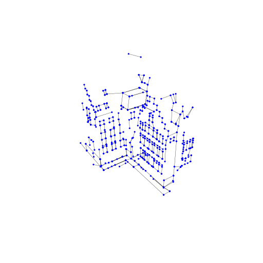

<table>
<tr>
    <th colspan="5">exps/dtu-wfr-v1-med/24/2023_02_07_21_26_23</th>
</tr>
<tr>
<th>Scan ID</th>
<th>Name of experiments</th>
<th>ACC</th>
<th>COMP</th>
<th>GIF</th>
</tr>
<tr>
<td>24</td>
<td>2000-wfi_checked</td>
<td>0.4736</td>
<td>6.6234</td>
<td rowspan="4">

</td>
</tr>
<tr>
<td>24</td>
<td>2000-wfi</td>
<td>0.7476</td>
<td>5.7579</td>
</tr>
<tr>
<td>24</td>
<td>2000-wfr</td>
<td>0.7820</td>
<td>5.8845</td>
</tr>
<tr>
<td>24</td>
<td>2000-wfr_checked</td>
<td>0.5461</td>
<td>7.0043</td>
</tr>
</table>
