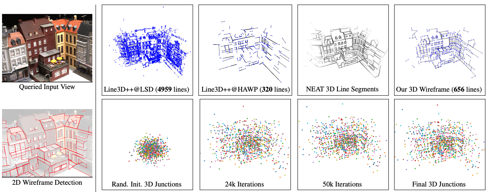
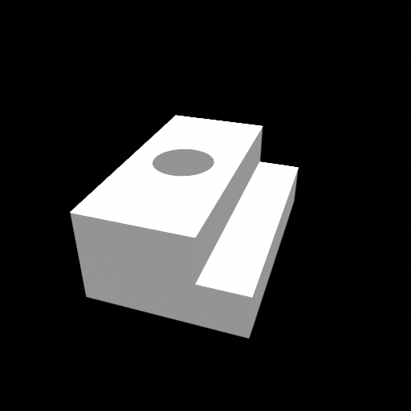
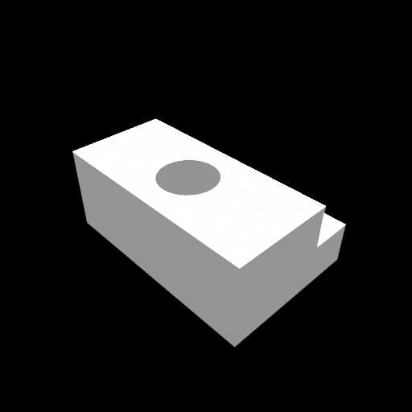
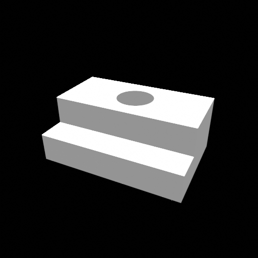
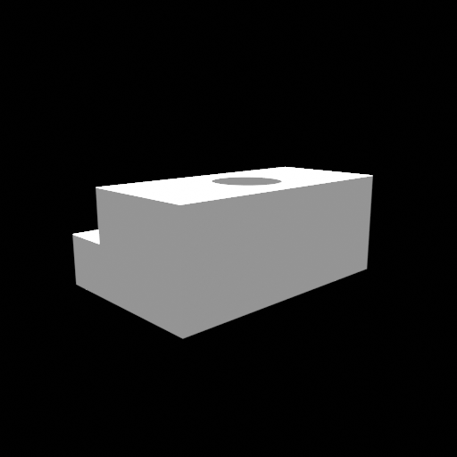

## Volumetric Wireframe Parsing from Neural Attraction Fields

> Volumetric Wireframe Parsing from Neural Attraction Fields
> 
> Nan Xue, Bin Tan, Yuxi Xiao, Liang Dong, Gui-Song Xia, Tianfu Wu
> 
> Preprint

<!-- insert the teaser -->


## Installation 
### Cloning the Repository
```
git clone https://github.com/cherubicXN/neat.git --recursive
```
### Pytorch 1.13.1 + CUDA 11.7 (Ubuntu 22.04 LTS)
#### 1. Create a conda env
```
conda create -n neat python=3.10
```
#### 2. Install PyTorch
```
pip install torch==1.13.1+cu117 torchvision==0.14.1+cu117 torchaudio==0.13.1 --extra-index-url https://download.pytorch.org/whl/cu117
```
#### 3. Install hawp from ``third-party/hawp``
```
cd third-party/hawp
pip install -e .
```
```bash
conda create -n neat python=3.10
pip install gputil gitpython pyhocon tqdm matplotlib plotly opencv-python scikit-image trimesh open3d 
pip install 'pyglet<2'
```

## A toy example on a simple object from the [ABC](https://deep-geometry.github.io/abc-dataset/) dataset









 
Please run the following command line to run the toy example for
```
python training/exp_runner.py \
    --conf confs/abc-debug/abc-neat-a.conf \
    --nepoch 2000 \ # Number of epochs for training/optimization
    --tbvis # Use tensorboard to visualize the 3D junctions
```
