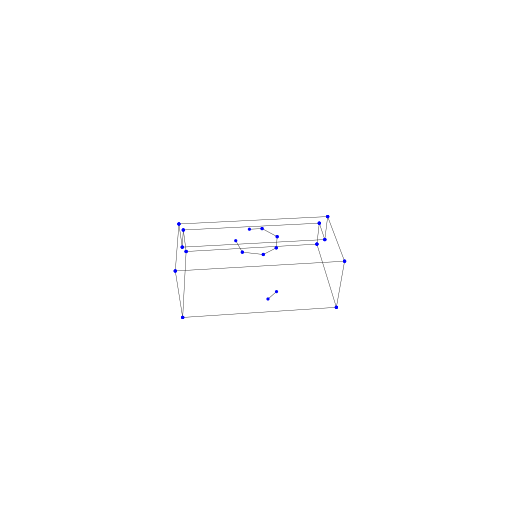

## NEAT: Neural Attraction Fields for 3D Wireframe Reconstruction

### Authors: Nan Xue, Bin Tan, Gui-Song Xia, Tianfu Wu

## Experiments
  <table>
  <tr>
    <th colspan=5>
      
    </th>
  </tr>
  <tr>
        <th>ABC-000075213</th><th colspan="4">exps/abc_000075213_neat/2023_02_17_09_50_32</th>
    </tr>
  <table>
    <tr>
        <th colspan="5">
          
        </th>
    </tr>
    <tr>
        <th>DTU-24</th><th colspan="4">exps/dtu-wfr-v1-med/24/2023_02_07_21_26_23</th>
    </tr>
    <tr>
      <th>Name of experiments</th>
      <th>ACC</th>
      <th>COMP</th>
      <th>ACC (Junctions)</th>
      <th>COMP (Junctions)</th>
    </tr>
    <tr>
    <td>2000-wfi_checked</td>
    <td><b>0.4736</b></td>
    <td>6.6234</td>
    <td rowspan="2"> <b>0.6892</b> </td>
    <td rowspan="2"> <b>8.4224</b> </td>
    </tr>
    <tr>
    <td>2000-wfi</td>
    <td>0.7476</td>
    <td>5.7579</td>
    </tr>
    <tr>
    <td>2000-wfr</td>
    <td>0.7820</td>
    <td>5.8845</td>
    <td rowspan="2"> 0.8668 </td>
    <td rowspan="2"> 8.8199 </td>
    </tr>
    <tr>
    <td>2000-wfr_checked</td>
    <td>0.5461</td>
    <td>7.0043</td>
    </tr>
  </table>

## Changelogs
- v0.0 ([4cef0e6d9545bdca00b22b47892aa952ec1b23b3](https://github.com/cherubicXN/neat/tree/4cef0e6d9545bdca00b22b47892aa952ec1b23b3))
  - Initially build the wireframe reconstruction pipeline 
    - It is amazing because we can learn the global junctions (and latents) via backpropogation
    - Huganrian Matching is extensively used to make connections between line segments and global junctions (latents)
    - Works well on DTU dataset with great generalization ability across scenes
    - dbscan is used for online clustering
  - confs
    - https://github.com/cherubicXN/neat/blob/13f12085a042f742e572f6421fe80363305bf8f2/code/confs/dtu-wfr.conf
    - https://github.com/cherubicXN/neat/blob/13f12085a042f742e572f6421fe80363305bf8f2/code/confs/bmvs-wfr.conf

- v0.1 (inprogress)
  - [x] Checking if the online clustering is necessary (dtu-wfr-v1.conf)
  - [x] Support wandb
- Plan
  - [ ] Checking if the online clustering is necessary
  - [ ] Using junctions for SDF and NEAT field learning
  - [ ] Other scenes (e.g., LLFF, Apple's dataset)
  - [x] Query 3D lines
