## Volumetric Wireframe Parsing from Neural Attraction Fields

> Volumetric Wireframe Parsing from Neural Attraction Fields
> 
> [Nan Xue](https://xuenan.net), [Bin Tan](https://icetttb.github.io), [Yuxi Xiao](https://henry123-boy.github.io), [Liang Dong](https://www.linkedin.com/in/liang-dong-4a435694), [Gui-Song Xia](https://scholar.google.com/citations?user=SAUCVsEAAAAJ&hl=en), [Tianfu Wu](https://research.ece.ncsu.edu/ivmcl)
> 
> 2023
>
> [Preprint](https://arxiv.org/abs/2307.10206) / [Code](https://github.com/cherubicXN/neat) / [Video](https://youtu.be/qtBQYbOpVpc)
>
> 
>

> <p align="center">
>    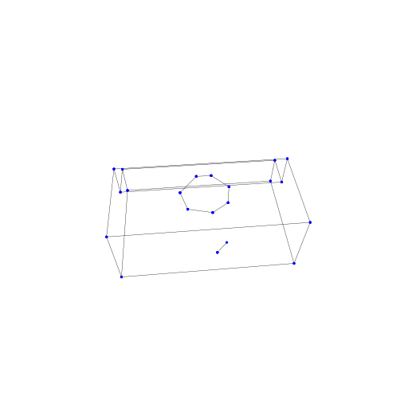
>    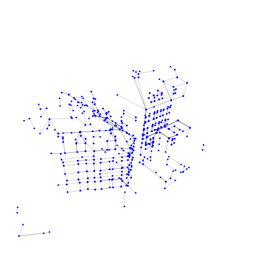
>    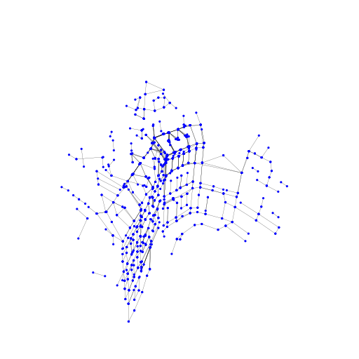
>    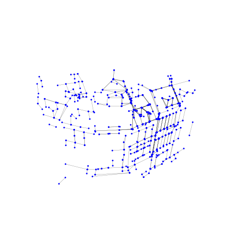
>    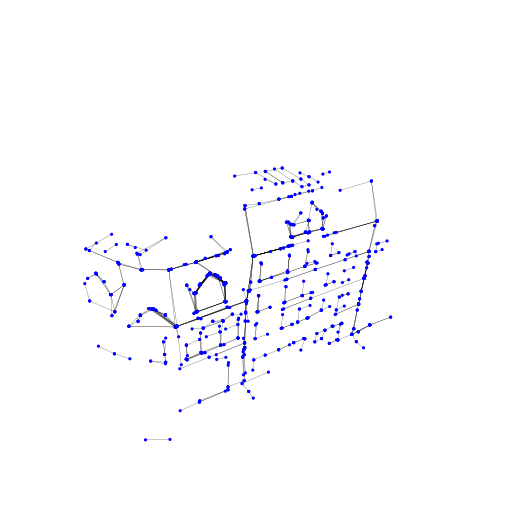
>    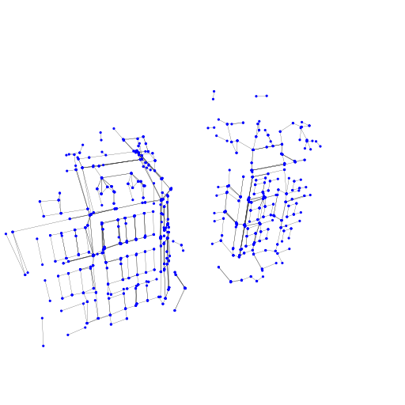
>    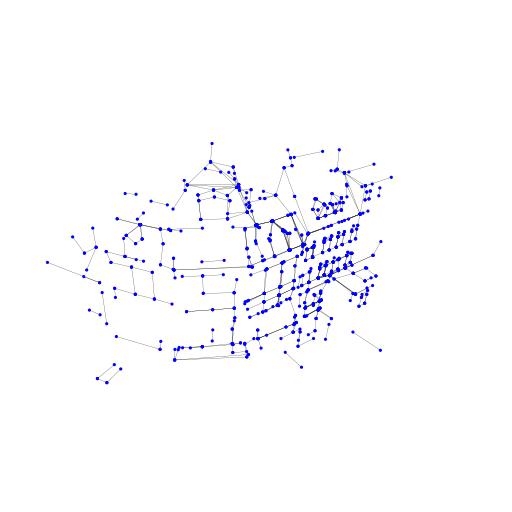
>    
>    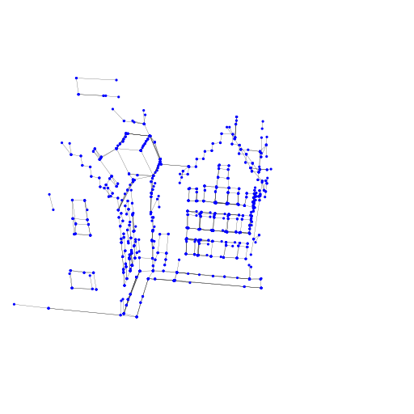
>    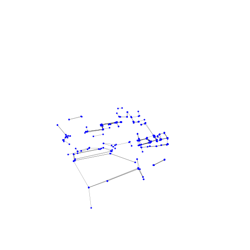
>    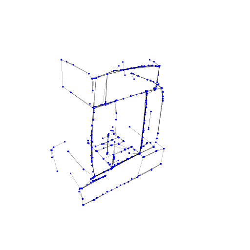
>    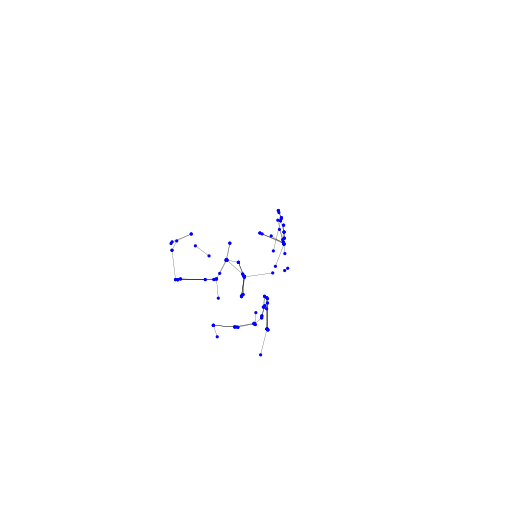
>    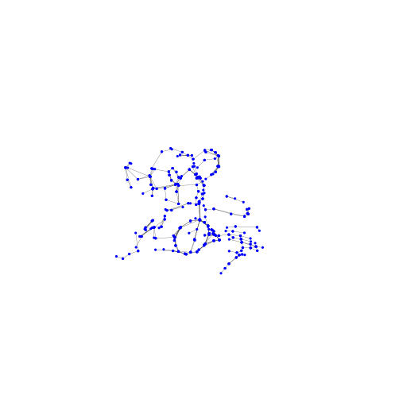
>    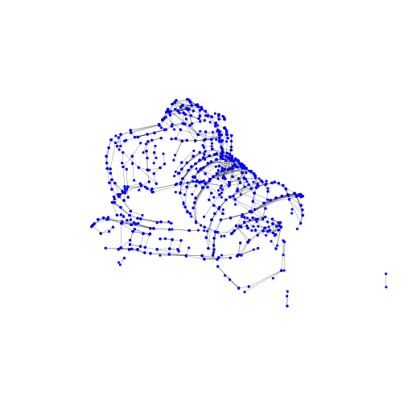
>    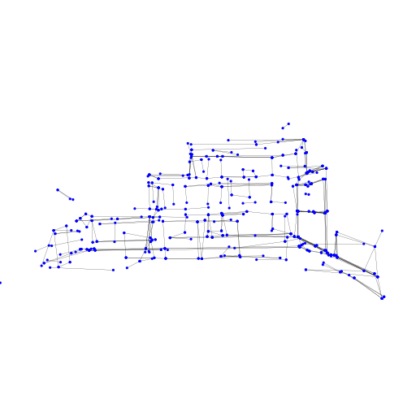
>    
>    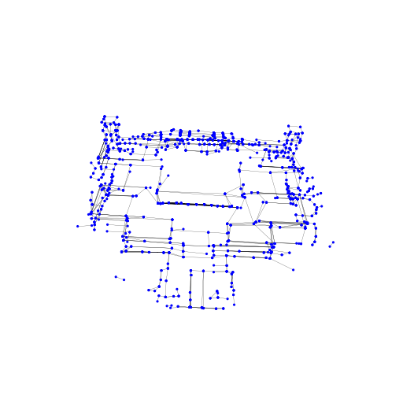
>    
> </p>
## Installation 
### Cloning the Repository
```
git clone https://github.com/cherubicXN/neat.git --recursive
```
### Pytorch 1.13.1 + CUDA 11.7 (Ubuntu 22.04 LTS)
#### 1. Create a conda env
```
conda create -n neat python=3.10
conda activate neat
```
#### 2. Install PyTorch
```
pip install torch==1.13.1+cu117 torchvision==0.14.1+cu117 torchaudio==0.13.1 --extra-index-url https://download.pytorch.org/whl/cu117
```
#### 3. Install [hawp](https://github.com/cherubicXN/hawp) from ``third-party/hawp``
```
cd third-party/hawp
pip install -e .
cd ../..
```

#### 4. Install other dependencies
```bash
pip install -r requirements.txt
```

#### 4. Run the experiments under the directory of ``code``

## A toy example on a simple object from the [ABC](https://deep-geometry.github.io/abc-dataset/) dataset
<p align="center">
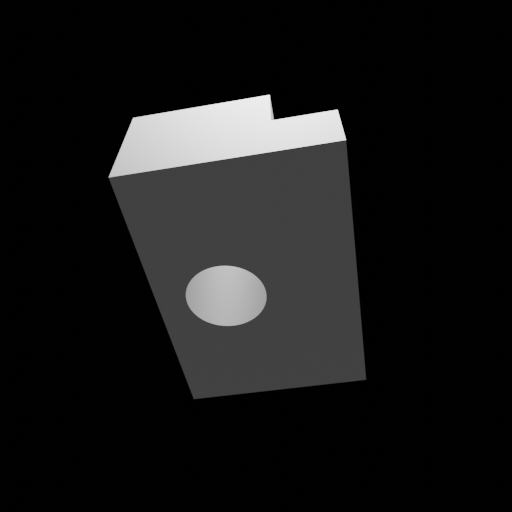


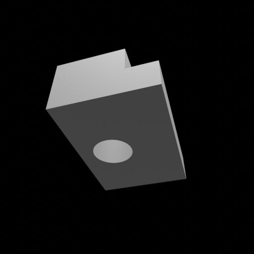

</p>
 

- Step 1: Training or Optimization
    ```
    python training/exp_runner.py \
        --conf confs/abc-debug/abc-neat-a.conf \
        --nepoch 2000 \ # Number of epochs for training/optimization
        --tbvis # Use tensorboard to visualize the 3D junctions
    ```
- Step 2: Finalize the NEAT wireframe model
    ```
    python neat-final-parsing.py --conf ../exps/abc-neat-a/{timestamp}/runconf.conf --checkpoint 1000
    ```
    After running the above command line, you will get 4 files at ``../exps/abc-neat-a/{timestamp}/wireframes`` with the prefix of ``{epoch}-{hash}*``, where ``{epoch}`` is the checkpoint you evaluated and ``{hash}`` is an hash of hyperparameters for finalization. 

    The four files are with the different suffix strings:
    - ``{epoch}-{hash}-all.npz`` stores the all line segments from the NEAT field,
    - ``{epoch}-{hash}-wfi.npz`` stores the initial wireframe model without visibility checking, containing some artifacts in terms of the wireframe edges,
    - ``{epoch}-{hash}-wfi_checked.npz`` stores the wireframe model after visibility checking to reduce the edge artifacts,
    - ``{epoch}-{hash}-neat.pth`` stores the above three files and some other information in the ``pth`` format.

- Step 3: Visualize the 3D wireframe model by
    ```
    python visualization/show.py --data ../exps/abc-neat-a/{timestamp}/wireframe/{filename}.npz 
    ```
    <p align="center">
    
    </p>

    - Currently, the visualization script only supports the local run.
    - The open3d (v0.17) plugin for tensorboard is slow


## DTU and BlendedMVS datasets (TODO)
- Precomputed results
- Data preparation
- Evaluation code

## Citations
If you find our work useful in your research, please consider citing
```
@article{NEAT-arxiv,
  author       = {Nan Xue and
                  Bin Tan and
                  Yuxi Xiao and
                  Liang Dong and
                  Gui{-}Song Xia and
                  Tianfu Wu},
  title        = {Volumetric Wireframe Parsing from Neural Attraction Fields},
  journal      = {CoRR},
  volume       = {abs/2307.10206},
  year         = {2023},
  url          = {https://doi.org/10.48550/arXiv.2307.10206},
  doi          = {10.48550/arXiv.2307.10206},
  eprinttype    = {arXiv},
  eprint       = {2307.10206}
}
```

## Acknowledgement
This project is built on [volsdf](https://github.com/lioryariv/volsdf). We also thank the four anonymous reviewers for their feedback for paper writing, listed as follow:
- *"The proposed method is novel and very interesting and the authors' rebuttal address some of my concerns. However, as pointed out by other reviewers, many parts need to be revised to clarify the proposed method, and another careful review is necessary after the revisions. Therefore, my final rating is Borderline Reject."* by Reviewer 2
- *"Despite my experience of over ten years in the field of 3D vision, I found it challenging to follow the submission, which is its main weakness."* by Reviewer 3
- *"As pointed out by all the reviewers, the paper needs significant rework on writing. Even after reading the authors' feedback, some key details are still lacking or confusing.
I do not think the paper in its current form is ready for publication, even adding the explanation provided in the authors' response."* by Reviewer 4
- *"After reading rebuttals and other reviews, I think this paper is not ready to be published as its writing need significant revisions. The overall idea nad method is novel and interesting, while the current draft has too many unclear points and I sincerely believe this paper could be hugely improved by revision."* by Reviewer 5

