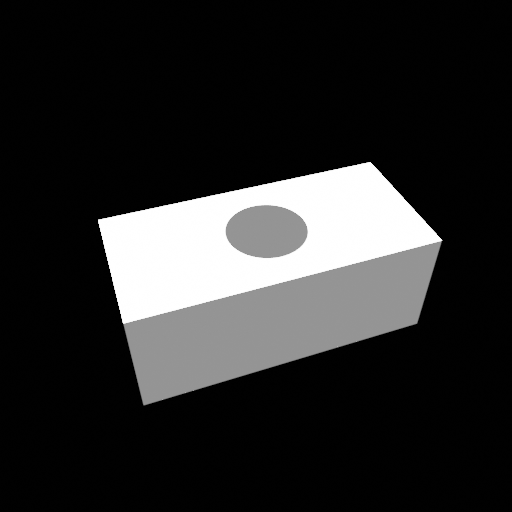

## Volumetric Wireframe Parsing from Neural Attraction Fields

> Volumetric Wireframe Parsing from Neural Attraction Fields
> 
> Nan Xue, Bin Tan, Yuxi Xiao, Liang Dong, Gui-Song Xia, Tianfu Wu
> 
> Preprint

<!-- insert the teaser -->


## Installation 
### Cloning the Repository
```
git clone https://github.com/cherubicXN/neat.git --recursive
```
### Pytorch 1.13.1 + CUDA 11.7 (Ubuntu 22.04 LTS)
#### 1. Create a conda env
```
conda create -n neat python=3.10
```
#### 2. Install PyTorch
```
pip install torch==1.13.1+cu117 torchvision==0.14.1+cu117 torchaudio==0.13.1 --extra-index-url https://download.pytorch.org/whl/cu117
```
#### 3. Install hawp from ``third-party/hawp``
```
cd third-party/hawp
pip install -e .
```
```bash
conda create -n neat python=3.10
pip install gputil gitpython pyhocon tqdm matplotlib plotly opencv-python scikit-image trimesh open3d 
pip install 'pyglet<2'
```

#### 4. Run the experiments under the directory of ``code``

## A toy example on a simple object from the [ABC](https://deep-geometry.github.io/abc-dataset/) dataset





 
- Step 1: Training or Optimization
    ```
    python training/exp_runner.py \
        --conf confs/abc-debug/abc-neat-a.conf \
        --nepoch 2000 \ # Number of epochs for training/optimization
        --tbvis # Use tensorboard to visualize the 3D junctions
    ```
- Step 2: Finalize the NEAT wireframe model
    ```
    python neat-final-parsing.py --conf ../exps/abc-neat-a/{timestamp}/runconf.conf --checkpoint 1000
    ```
- Step 3: Visualize the 3D wireframe model by
    ```
    python
    ```
    - Currently, the visualization script only supports the local run.
    - The open3d (v0.17) plugin for tensorboard is slow


## Citations
If you find our work useful in your research, please consider citing
```
@article{NEAT-arxiv,
  author       = {Nan Xue and
                  Bin Tan and
                  Yuxi Xiao and
                  Liang Dong and
                  Gui{-}Song Xia and
                  Tianfu Wu},
  title        = {Volumetric Wireframe Parsing from Neural Attraction Fields},
  journal      = {CoRR},
  volume       = {abs/2307.10206},
  year         = {2023},
  url          = {https://doi.org/10.48550/arXiv.2307.10206},
  doi          = {10.48550/arXiv.2307.10206},
  eprinttype    = {arXiv},
  eprint       = {2307.10206}
}
```